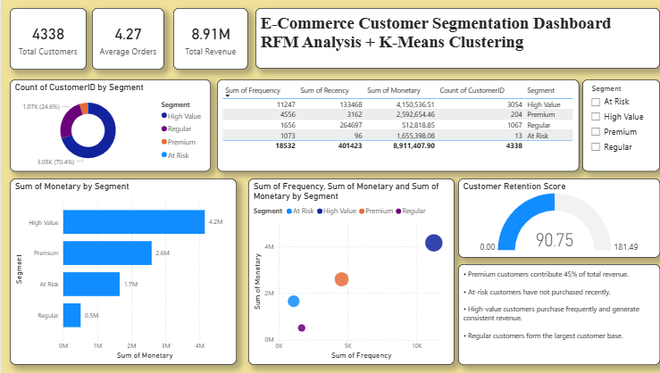
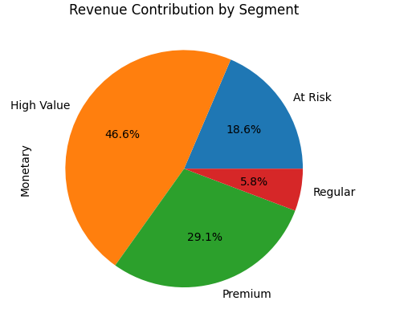
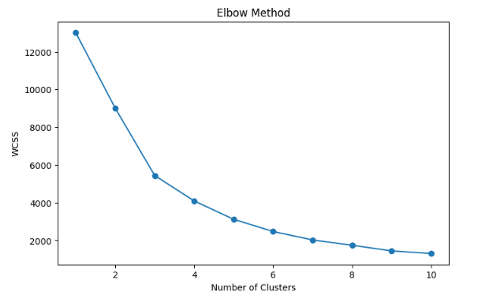

# 🛒 E-Commerce Customer Segmentation using RFM Analysis & K-Means Clustering

## 📌 Project Overview

This project focuses on customer segmentation for an e-commerce business using **RFM (Recency, Frequency, Monetary) Analysis** and **K-Means Clustering**. The objective is to identify different customer groups based on purchasing behavior and provide actionable business insights for targeted marketing, customer retention, and revenue optimization.

---

## 🚀 Business Problem

E-commerce businesses often struggle to identify:

- High-value customers
- Loyal customers
- At-risk customers
- Customers likely to churn

By segmenting customers into meaningful groups, businesses can create personalized marketing campaigns and improve customer retention strategies.

---

## 🛠️ Technologies Used

- Python
- Pandas
- NumPy
- Matplotlib
- Seaborn
- Scikit-Learn
- Google Colab
- Power BI

---

## 📂 Dataset

**Online Retail Dataset**

Dataset contains:
- CustomerID
- InvoiceNo
- InvoiceDate
- Quantity
- UnitPrice
- Country
- Product Information

Total Records: **500,000+ transactions**

---

## 🔄 Project Workflow

### 1️⃣ Data Cleaning

- Removed missing Customer IDs
- Removed cancelled transactions
- Removed negative quantities
- Removed invalid prices

### 2️⃣ Feature Engineering

Created Revenue Feature:

```python
Revenue = Quantity × UnitPrice
```

### 3️⃣ RFM Analysis

Calculated:

- Recency → Days since last purchase
- Frequency → Number of purchases
- Monetary → Total spending

### 4️⃣ Customer Segmentation

Applied:

- StandardScaler
- K-Means Clustering

Used Elbow Method to determine optimal number of clusters.

### 5️⃣ Business Insights

Identified customer segments:

- High Value Customers
- Premium Customers
- Regular Customers
- At Risk Customers

---

## 📊 Power BI Dashboard

Dashboard includes:

### Executive Summary

- Total Customers
- Total Revenue
- Average Orders

### Customer Segmentation Analysis

- Revenue by Segment
- Customer Distribution by Segment
- Customer Segmentation Scatter Plot
- Customer Retention Score

### Business Insights

- High Value customers contribute the highest revenue.
- Premium customers exhibit strong purchasing behavior.
- At-Risk customers require retention campaigns.
- Regular customers form the largest customer base.

---

## 📈 Key Results

| Metric | Value |
|----------|----------|
| Total Customers | 4,338 |
| Total Revenue | 8.91 Million |
| Average Orders | 4.27 |
| Segments Identified | 4 |

### Revenue Contribution

| Segment | Revenue Share |
|----------|----------|
| High Value | 46.6% |
| Premium | 29.1% |
| At Risk | 18.6% |
| Regular | 5.8% |

---

## 📷 Dashboard Preview

### Customer Segmentation Dashboard



### Revenue Contribution by Segment



### RFM Distribution


### Elbow Method



---

## 📁 Project Structure

```text
Ecommerce-Customer-Segmentation/
│
├── data/
│   └── customer_segments.csv
│
├── notebooks/
│   ├── 01_data_cleaning_and_eda.ipynb
│   └── 02_rfm_and_kmeans_segmentation.ipynb
│
├── dashboard/
│   └── Ecommerce_Customer_Segmentation.pbix
│
├── screenshots/
│   ├── customer_segmentation_dashboard.png
│   ├── revenue_contribution_by_segment.png
│   ├── rfm_distribution.png
│   └── elbow_method.png
│
├── requirements.txt
└── README.md
```

---

## 💡 Skills Demonstrated

- Data Cleaning
- Exploratory Data Analysis (EDA)
- Feature Engineering
- RFM Analysis
- Customer Segmentation
- K-Means Clustering
- Data Visualization
- Business Intelligence
- Power BI Dashboard Development
- Business Insight Generation

---

## 🎯 Future Enhancements

- Customer Lifetime Value (CLV) Analysis
- Customer Churn Prediction
- Marketing Campaign Optimization
- Recommendation System Integration

---

## 👨‍💻 Author

**Sharanprabhu Kudhalli**

Computer Science Engineer | Aspiring Data Analyst | Data Science Enthusiast

📧 Connect with me on LinkedIn and GitHub.

---

⭐ If you found this project useful, consider giving it a star!
